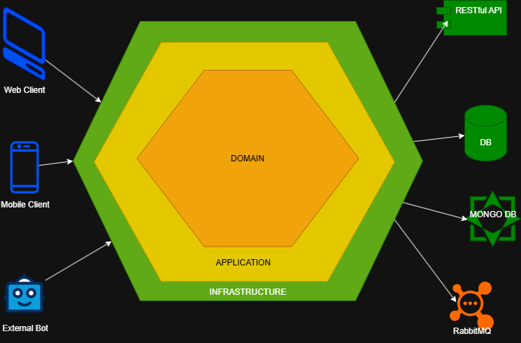
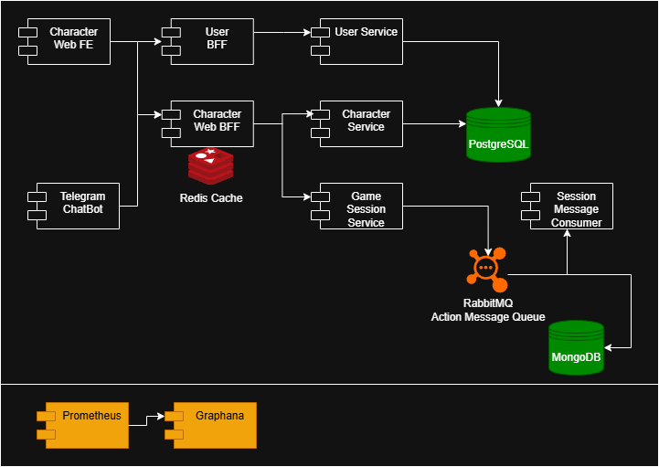

# kanionland-character-system
A Java-Spring based project solution for TTRPG custom system for Kanion-Land Roleplay Group, focused in character creation, upgrades, evolution, inventory operations, damage calculation, etc.


## Installation

1. Clone the repository:
   ```bash
   git clone
   
2. Ensure the following prerequisites are installed:
   - Java 11 or higher
   - Maven 3.6 or higher

3. Set the current Spring profile to local:
    Linux/macOS
   ```bash 
   export SPRING_PROFILES_ACTIVE=local
   ```
    Windows
   ```cmd
   set SPRING_PROFILES_ACTIVE=local
   ```

4. Build the project using Maven:
   ```bash
   mvn clean install
   ```
5. Run the application:
   ```bash
   mvn spring-boot:run
   ```
6. Access the application at `http://localhost:8080`.

## Implementation Details
- This service is a Backend-For-Frontend (BFF) that is expected to be consumed by either a FrontEnd or a Chatbot from Telegram or Discord.
- The project is structured using Spring Boot and follows best practices for RESTful API design.
- Hexagonal Architecture principles are applied to ensure maintainability and scalability.
  - This approach is preferred than Clean Architecture as the size of the microservice is not expected to hold too many operations or concerns, while still providing a clear separation of concerns and a better maintainability. 
  - The business logic doesn't represent a high complexity for the system, so using a Clean Architecture approach could lead to over-engineering.
  - Hexagonal Architecture is also focused on separation of concerns through ports and adapters, bringing easier adaptation to external consumers, services and frameworks.
- Endpoint definition is provided through API First contracts using OpenAPI/Swagger.
- The project includes unit and integration tests to ensure code quality and reliability, relying mostly on JUnit and Mockito.

## Scope
- This BFF will only be in charge of Character System operations for Kanion-Land TTRPG.
- As such, the system will not handle user authentication or authorization, which will be managed by a separate service.
- On the same manner, the BFF won't be in charge of persistence operations, as dedicated microservices will handle data storage and retrieval. 
- The BFF will communicate with these microservices through well-defined RESTful APIs.

- For performance and scalability, this service will use a Redis Cache to store frequently accessed data and reduce latency, while also minimizing the load on the underlying microservices (and costs as well). Cached records will have their own TTL (Time To Live) and eviction policies to ensure data consistency and freshness.